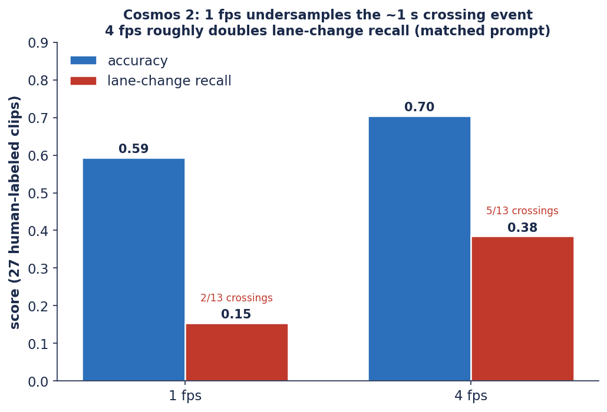
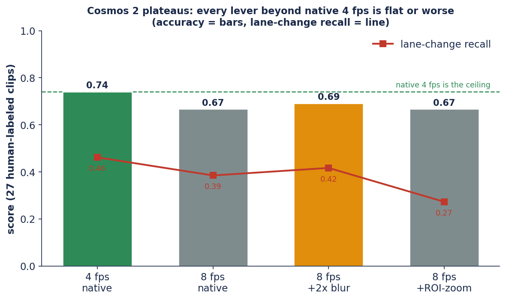

# Frame Rate Is the Dominant Input Lever for Cosmos 2 on Ego-Lane Behavior

*A companion study to the Cosmos 3 report. We isolate the most influential input
setting for **Cosmos-Reason2-32B** on ego-lane behavior recognition — the video
frame rate — and find that Cosmos 2 reaches its best score at its native 4 fps
configuration; the additional input-budget levers that benefit Cosmos 3 did not
improve Cosmos 2 in our experiments.*

| | |
|---|---|
| **Version** | 1.0 — June 11, 2026 |
| **Repository** | [`ykirpichev/cosmos-reason2-lane-eval`](https://github.com/ykirpichev/cosmos-reason2-lane-eval) |
| **Model** | `nvidia/Cosmos-Reason2-32B`, served via Docker vLLM |
| **Evaluation set** | 27 human-labeled BATON dashcam clips (13 lane-crossings, 14 lane-keeps); 150-clip pseudo-label scale check |
| **Companion report** | [Cosmos 3 staged diagnosis](cosmos3_report.md) |

> **Executive summary.** For Cosmos-Reason2-32B on ego-lane behavior
> classification, the **video frame rate is the dominant input setting**: raising
> it from 1 fps to 4 fps roughly **doubles lane-change recall** (0.15 → 0.38) and
> lifts accuracy 0.59 → 0.70 on 27 human-labeled dashcam clips, because the
> ≈1-second crossing event is undersampled at 1 fps. Cosmos&nbsp;2 reaches its
> best score at **native 4 fps (accuracy 0.74)**; further increases in frames or
> pixels (including the ROI-crop + zoom that benefits Cosmos&nbsp;3) did not
> improve it in our experiments. Practical guidance: profile each model's
> frame-rate sensitivity first, and validate input-budget adjustments per model.
> The evaluation set is small (27 clips), so comparative deltas carry a ±0.1
> noise floor (§8).

> **Reproducibility status.** All numbers are recomputed from committed artifacts by
> `scripts/make_cosmos2_figs.py` and `scripts/headtohead.py`. The controlled
> frame-rate experiment uses a **matched prompt** (`results/summary_fps1.json` at
> 1 fps vs `results/summary_oldtaxonomy.json` at 4 fps); the config ladder uses the
> taxonomy-normalized runs in `results/headtohead.json`.

---

## Abstract

We study **Cosmos-Reason2-32B** ("Cosmos 2") on ego-lane behavior recognition —
classifying a 12-second dashcam clip as *lane keep*, *lane change*, or *lane
wandering*. The practically important error is the **silent miss**: declaring
`keep_within_lane` on a clip that contains a real lane change. We find that for
Cosmos 2 the dominant driver of this error is the **temporal sampling rate**. In a
controlled, prompt-matched experiment, raising the frame rate **1 fps → 4 fps**
roughly doubles lane-change recall (0.15 → 0.38 on 27 human-labeled clips; 0.07 →
0.18 on the full 150-clip set) and lifts accuracy 0.59 → 0.70 — because the
≈1-second crossing event is not sampled densely enough at 1 fps. Beyond that
point, the pattern differs from Cosmos 3: pushing further (8 fps), or spending
more *spatial* tokens (whole-frame 2× upscale, ROI-crop + zoom), did **not**
improve Cosmos 2 in our experiments — its best configuration is **native 4 fps
(accuracy 0.74)**, with each additional lever flat or slightly lower. The
input-budget adjustments that are decisive for Cosmos 3 (see the Cosmos 3 report)
did not transfer to Cosmos 2 on this task.

---

## 1. Introduction

Reasoning VLMs are attractive zero-shot classifiers for driving-log mining, but
their accuracy is highly sensitive to how the video is *presented* to the model, not
just to model scale. This report isolates that effect for the previous-generation
**Cosmos 2** and answers two questions:

1. **(§3) How much does frame rate matter?** A controlled 1 fps vs 4 fps comparison
   (identical clips, prompt, and decoding) shows frame rate is the dominant lever:
   at 1 fps the brief lane-crossing event is undersampled and recall collapses.
2. **(§4–5) Does Cosmos 2 keep improving with more budget?** In our experiments,
   no. Beyond 4 fps, neither more frames nor more (even targeted) pixels improved
   its scores; Cosmos 2 performed best at its native 4 fps configuration.

This complements the Cosmos 3 finding (`docs/cosmos3_report.md`), where 8 fps +
ROI-crop zoom gives the largest gain. Read together, the two reports make a single
point: **input-budget adjustments are model-specific and should be validated per
model.**

---

## 2. Task and dataset

Three mutually exclusive behaviors:

| behavior | definition |
|---|---|
| `keep_within_lane` | stays inside the lane; never crosses a lane line |
| `lane_change` | crosses a line and settles in a different lane |
| `lane_wandering` | crosses/rides a line but returns to the same lane |

**Clips.** 150 single-camera BATON clips (openpilot `qcamera`, native **526×330**,
12 s). **Ground truth** is **27 human-labeled clips** (13 lane-crossings, 14
lane-keeps); the full 150-clip set is scored only against noisy openpilot
**pseudo-labels** (lateral-offset derived) and is used for scale/consistency checks.
The positive class for precision/recall/F1 is `lane_change` ("crossing").

**Model and serving.** `nvidia/Cosmos-Reason2-32B`, served via Docker vLLM
(`scripts/serve_vllm.sh`, 32k context, `--reasoning-parser qwen3`).

---

## 3. The frame-rate study: 1 fps vs 4 fps

A lane change occupies roughly **1 second** of a 12-second clip. At **1 fps** that
event is carried by ≈1 frame, so the model rarely sees the line actually being
crossed. We compare 1 fps and 4 fps under an **identical prompt and decoding**
(the only change is how many frames are sampled), scoring against human ground truth.



**Figure 1.** Controlled frame-rate experiment on the 27 human-labeled clips
(matched prompt). Raising 1 → 4 fps lifts accuracy 0.59 → 0.70 and **doubles
lane-change recall** (0.15 → 0.38), i.e. from catching 2/13 crossings to 5/13, at
unchanged (perfect) precision.

| Cosmos 2 (matched prompt) | accuracy | crossing P | R | F1 | crossings caught |
|---|---|---|---|---|---|
| **1 fps** | 0.59 | 1.00 | 0.15 | 0.27 | 2 / 13 |
| **4 fps** | **0.70** | 1.00 | **0.38** | **0.56** | 5 / 13 |

The same effect holds at scale on the full 150-clip set (openpilot pseudo-labels;
noisier, but directionally identical):

| Cosmos 2 (matched prompt, full set) | n | accuracy | crossing recall |
|---|---|---|---|
| 1 fps | 150 | 0.42 | 0.07 (4 / 60) |
| 4 fps | 149 | 0.48 | 0.18 (11 / 60) |

**Finding.** Frame rate is the dominant lever for Cosmos 2. At 1 fps most
crossings are simply not present in the sampled frames; 4 fps recovers a large
fraction of them without any change to the model, prompt, or labels. We therefore
use **4 fps** as the Cosmos 2 reference rate.

---

## 4. Beyond 4 fps: additional levers did not improve Cosmos 2

Having established that 4 fps outperforms 1 fps, the natural next step — and the
one that benefits Cosmos 3 — is to push the budget further: more frames (8 fps),
more pixels (whole-frame 2× upscale), or *targeted* pixels (ROI-crop + zoom on the
road band; see the Cosmos 3 report §4.5 for the mechanics). For Cosmos 2, none of
these improved its scores in our experiments. All runs below use greedy decoding
and the taxonomy-normalized scorer.



**Figure 2.** Cosmos 2 across the config ladder (27 human-labeled clips; accuracy =
bars, lane-change recall = line). Native 4 fps gives the highest score (0.74);
8 fps scores lower, the whole-frame 2× upscale does not recover it, and ROI-crop +
zoom — the most effective lever for Cosmos 3 — coincides with the lowest crossing
recall (0.27).

| config (27 clips, greedy) | accuracy | crossing P | R | F1 | false-pos |
|---|---|---|---|---|---|
| **4 fps native (best)** | **0.74** | 1.00 | 0.46 | 0.63 | 0 |
| 8 fps native | 0.67 | 0.83 | 0.38 | 0.53 | 1 |
| 8 fps + whole-frame 2× | 0.69¹ | 0.83 | 0.42 | 0.56 | 1 |
| 8 fps + ROI-crop + zoom | 0.67² | 1.00 | 0.27 | 0.43 | 0 |

¹ n=26, ² n=24 — a few Cosmos 2 generations returned unparseable JSON and are
excluded; the trend is unaffected. *Source: `results/headtohead.json`.*

For Cosmos 2, raising the frame rate past 4 fps lowers accuracy (0.74 → 0.67), and
the ROI-zoom that lifts Cosmos 3 by +0.15 coincides with Cosmos 2's lowest
crossing recall (0.27): its missed crossings are not converted into detections by
reallocating the spatial budget.

---

## 5. Interpreting the Cosmos 2 results

The error signature is consistent across every configuration: **high precision,
low recall.** Cosmos 2 rarely reports a lane change that did not occur (precision
stays at 0.83–1.00), but it misses a substantial fraction of real ones. Unlike
Cosmos 3 — whose misses were recoverable by giving it more legible road pixels —
Cosmos 2's misses did not respond to the spatial budget in our experiments:
enlarging the lane markings (ROI-zoom) did not convert them into detections. This
suggests that, on this fine-grained temporal task, Cosmos 2's recall is not
limited by input presentation alone — though we cannot rule out that other
interventions (e.g. different prompting or framing) would change the picture.

On the full 150-clip set at the final ROI configuration, Cosmos 2 lands at
**accuracy 0.52, crossing recall 0.26** (pseudo-labels) — consistent with its
27-clip behavior at scale.

---

## 6. Relation to Cosmos 3

The two models respond differently to the same levers (matched ladder, 27 clips):

| config | Cosmos 2 acc | Cosmos 3 acc |
|---|---|---|
| 4 fps native | **0.74** | 0.56 |
| 8 fps native | 0.67 | 0.78 |
| 8 fps + whole-frame 2× | 0.69 | 0.74 |
| 8 fps + ROI-crop + zoom | 0.67 | **0.93** |

- **Cosmos 2** scores highest at **native 4 fps**; additional budget did not help.
- **Cosmos 3** starts below Cosmos 2 at its native rate but, once its input is
  tuned (8 fps + ROI-zoom), reaches **0.93** — +0.19 accuracy / +0.39
  crossing recall relative to the best Cosmos 2 configuration on this set.

The takeaway is not a model ranking but that **the right input budget is
model-specific**: Cosmos 2 performs best at 4 fps with no further gains from added
budget, while Cosmos 3 benefits from more frames *and* targeted spatial tokens.
See `docs/cosmos3_report.md` §5.1 for the full head-to-head figure and discussion.

---

## 7. Reproducibility

```bash
# Cosmos 2 figures (1 fps vs 4 fps; the config ladder)
.venv/bin/python scripts/make_cosmos2_figs.py     # -> docs/assets/cosmos2/

# Controlled frame-rate runs (matched prompt; full BATON set)
#   1 fps -> results/summary_fps1.json
#   4 fps -> results/summary_oldtaxonomy.json
.venv/bin/python scripts/run_batch.py \
  --manifest clips/manifest_all.json \
  --model nvidia/Cosmos-Reason2-32B --fps 1 \
  --media-path-prefix "$PWD" --output results/<run>   # (rename summary as above)

# Config ladder (8 fps native, whole-frame 2x, ROI-zoom) + consolidation
bash scripts/_run_cosmos2.sh
.venv/bin/python scripts/headtohead.py            # -> results/headtohead.json

# Inspect individual cases (run/mode/clip deep-linked)
.venv/bin/streamlit run apps/review_disagreements.py --server.port 8503
```

---

## 8. Limitations

- **Small ground-truth set.** Headline metrics are on 27 clips (13 crossings); ±1–2
  detections move F1 by ~0.1. The full-set numbers use noisy pseudo-labels.
- **Prompt-version caveat.** The controlled 1-vs-4 fps experiment (§3) uses the
  earlier single-label prompt for *both* rates (a clean A/B); the config ladder (§4)
  uses the later taxonomy-normalized prompt. The tuned prompt lifts 4 fps slightly
  (0.70 → 0.74), which is why §4's best 4 fps number is 0.74. The 1-vs-4 *difference*
  is unaffected because both sides share the prompt.
- **Unparseable generations.** A few Cosmos 2 outputs at 8 fps + 2× / ROI failed JSON
  parsing and are excluded (n=26 / n=24), marked explicitly.

---

## 9. Conclusion

For Cosmos 2 on ego-lane behavior, **frame rate is the dominant input lever**:
moving from 1 fps to 4 fps roughly doubles lane-change recall by sampling the brief
crossing event densely enough to see it. Beyond that, Cosmos 2 reached its best
score at native 4 fps in our experiments — additional frames lowered accuracy, and
additional pixels (even ROI-targeted) did not convert its misses into detections.
This contrasts with Cosmos 3, which improves substantially when given a higher
frame rate *and* a targeted spatial token budget. The practical lesson for
deploying reasoning VLMs on video: **profile the frame-rate sensitivity of each
model first, and validate input-budget adjustments per model rather than assuming
they transfer across model generations.**
