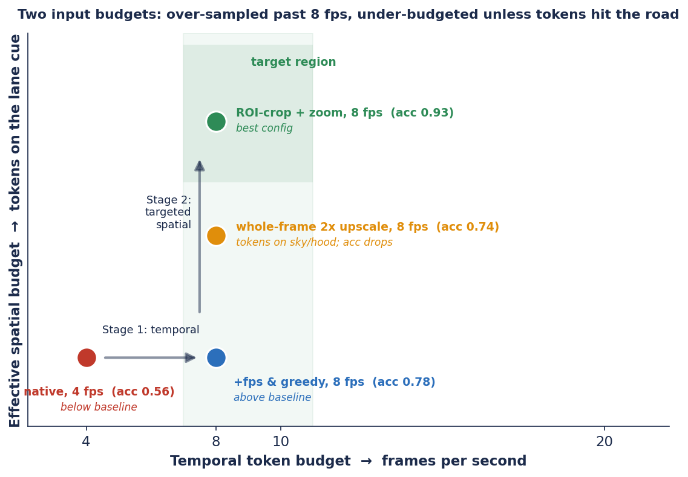
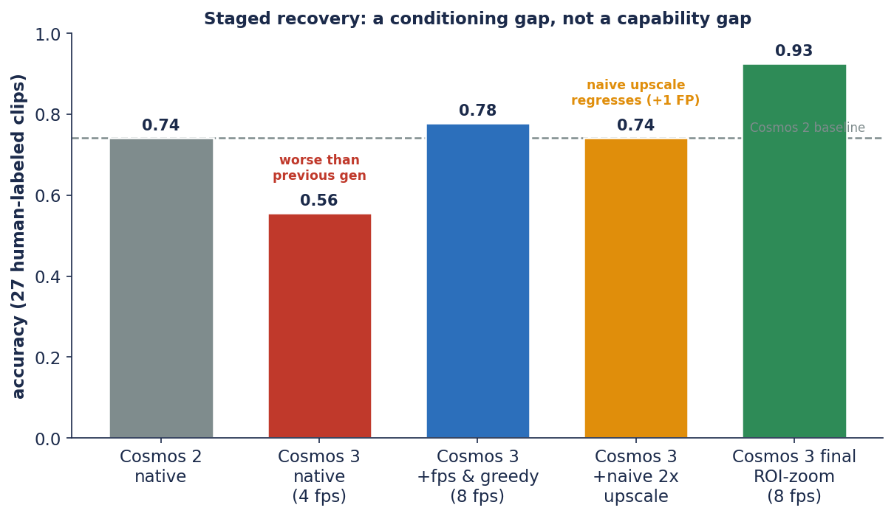
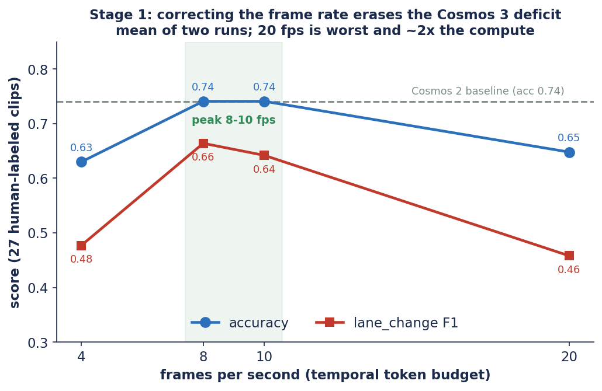
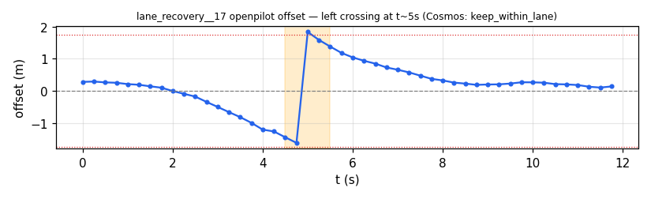
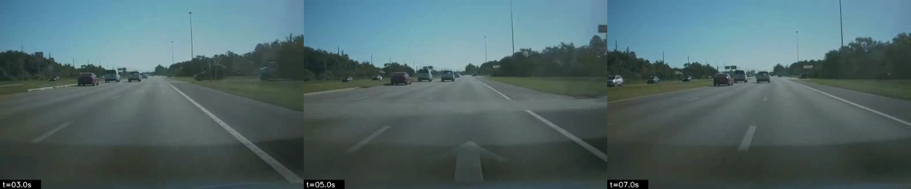
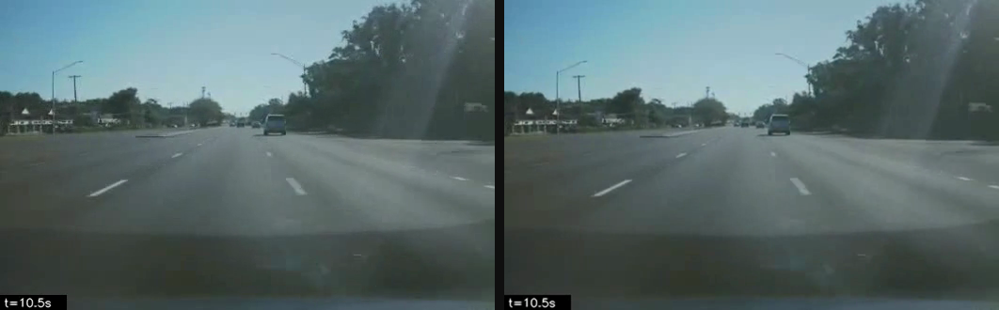
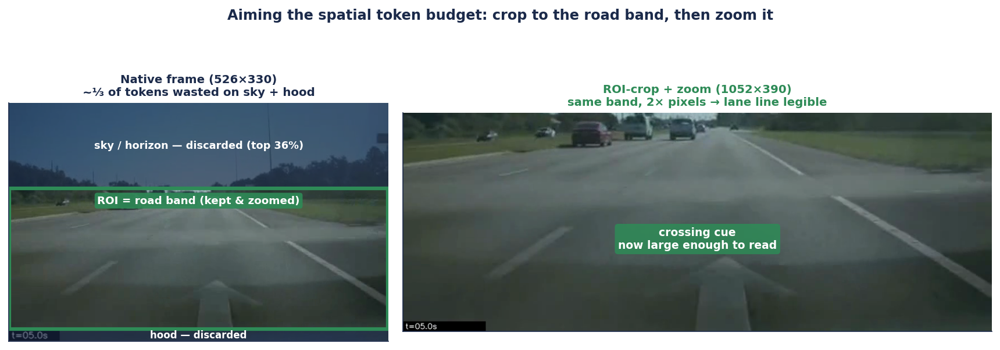
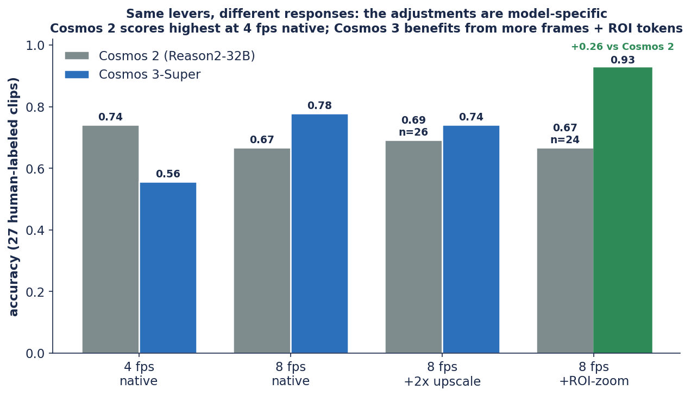

# Detecting Ego-Lane Behavior with Vision–Language Reasoners: A Staged Diagnosis of Cosmos&nbsp;3

*A case study in improving a reasoning VLM's accuracy on a lane-behavior task by
separately tuning temporal sampling and spatial token allocation, including an
ablation showing that targeted spatial tokens outperform uniform upscaling.*

| | |
|---|---|
| **Version** | 1.0 — June 11, 2026 |
| **Repository** | [`ykirpichev/cosmos-reason2-lane-eval`](https://github.com/ykirpichev/cosmos-reason2-lane-eval) |
| **Models** | `nvidia/Cosmos3-Super` (primary), `nvidia/Cosmos-Reason2-32B` (baseline), both served via vLLM |
| **Evaluation set** | 27 human-labeled BATON dashcam clips (13 lane-crossings, 14 lane-keeps); 150-clip pseudo-label scale check |
| **Companion report** | [Cosmos 2 frame-rate study](cosmos2_report.md) |

> **Executive summary.** Cosmos&nbsp;3-Super reaches **0.93 accuracy / 0.92 F1
> (zero false positives)** on ego-lane behavior classification over 27
> human-labeled dashcam clips — up from **0.56 at default input settings** — with
> no model or prompt changes. The gain comes entirely from input conditioning:
> **(1)** sampling video at 8 fps instead of 4 fps, **(2)** greedy decoding, and
> **(3)** cropping each frame to the road region and zooming it 2× so the
> model's visual tokens are spent on the lane markings (ROI-crop + zoom).
> Targeting matters: the ROI approach outperforms a uniform whole-frame 2×
> upscale by a wide margin (0.93 vs 0.74). The same adjustments did not improve the
> previous-generation Cosmos&nbsp;2, so input budgets should be profiled per
> model. All numbers are reproducible from committed artifacts; note the
> evaluation set is small (27 clips), so comparative deltas carry a ±0.1 noise
> floor (§8).

> **Reproducibility status.** All numbers are final and reproducible from committed
> artifacts. Both models were evaluated under the **full matched ladder** (4 fps
> native, 8 fps native, whole-frame 2×, ROI-zoom) on the 27 human-labeled clips
> (`results/cosmos{2,3}_final_*`, `results/{exp_roi8,cosmos2_roi8}/`), consolidated
> by `scripts/headtohead.py` into `results/headtohead.json`. The final ROI config is
> additionally run on the full 150-clip BATON set against openpilot pseudo-labels
> (`results/cosmos{2,3}_roi8_full159/`).

---

## Abstract

We study **ego-lane behavior recognition** — classifying a 12-second dashcam clip
as *lane keep*, *lane change*, or *lane wandering* — using two reasoning
vision–language models, **Cosmos&nbsp;3-Super** and **Cosmos-Reason2-32B**. At
default settings, Cosmos&nbsp;3 scores below Cosmos&nbsp;2 on this task (accuracy
0.56 vs 0.74; lane-change recall 0.23 vs 0.46 on 27 human-labeled clips). We find
this gap is largely attributable to **input conditioning** rather than model
capability, and we close it in two independent stages. **Stage&nbsp;1
(temporal):** the default sampling rate under-samples the brief (≈1 s)
lane-crossing event; adjusting it (4→8 fps) and switching to greedy decoding
brings Cosmos&nbsp;3 above the Cosmos&nbsp;2 baseline (0.56→0.78, zero false
positives). **Stage&nbsp;2 (spatial):** the residual errors are confident *missed*
changes whose cue (a lane line sliding under the hood) is below the model's
effective spatial resolution. Here we report a negative result: a **whole-frame 2×
upscale slightly reduces accuracy** (0.78→0.74, and adds a false positive),
because the additional token budget is spent on regions that carry no lane
information (sky, hood). Allocating tokens *where the cue is* — an **ROI-crop +
zoom** on the road region — raises accuracy to **0.93** (F1 0.92, zero false
positives), recovering all but two crossings (both flagged for label re-review).
The methodological observation is that **temporal and spatial input budgets are
distinct, separately diagnosable factors, and the spatial budget helps most when
it is targeted at the relevant region.** Finally, a **matched ladder on
Cosmos&nbsp;2** indicates the adjustments are **model-specific**: the same levers
that benefit Cosmos&nbsp;3 leave Cosmos&nbsp;2 flat or slightly lower (it scores
highest, 0.74, in its native 4 fps configuration). On this evaluation set, the
tuned Cosmos&nbsp;3 configuration exceeds the best Cosmos&nbsp;2 configuration by
+0.19 accuracy (0.93 vs 0.74) and +0.39 crossing recall (0.85 vs 0.46), subject
to the small-sample caveats of §8.

---

## 1. Introduction

Reasoning-oriented vision–language models (VLMs) are increasingly applied to
driving perception as zero-shot classifiers and explainers. Their measured
accuracy, however, can depend as much on **how the video is presented** (frame
rate, resolution, framing) as on the model itself. We document a case where
default input settings substantially understate a model's ability on a task, and
describe a **repeatable diagnostic procedure** for separating input-conditioning
effects from model capability.

The task is ego-lane behavior recognition on openpilot dashcam clips. The
practically important error is the **silent miss**: the model declares
`keep_within_lane` with high confidence on a clip that contains a real lane change.
Such errors are costly for downstream mining (they remove positive examples)
and are invisible without ground truth.

We make three claims, each backed by controlled experiments:

1. **(§3) Cosmos&nbsp;3's initial gap is a temporal-sampling artifact.** A
   frame-rate sweep moves accuracy from 0.56→0.74 with no change to the model,
   prompt, or labels; greedy decoding then removes the remaining sampling variance
   and lifts it to **0.78**, above the baseline.
2. **(§4) The residual errors trace to spatial token *allocation*, and the most
   obvious intervention does not help.** Raising the per-frame token budget by
   upscaling the whole frame slightly lowers accuracy (0.78→0.74, with one added
   false positive): the extra tokens go to regions without lane information.
   Directing the budget at the road region (ROI-crop + zoom) instead lifts
   accuracy to **0.93** (F1 0.92, zero false positives).
3. **(§5–6) The effective adjustments are independent and composable** — corrected
   frame rate + greedy decoding (temporal) and ROI-crop zoom (targeted spatial) —
   while whole-frame upscaling and per-request pixel kwargs are documented
   negative results. We additionally harden the output parser so out-of-taxonomy
   labels and timeline/summary disagreements cannot corrupt scoring (§4.5).



**Figure 1.** The central observation. A video reasoner consumes two distinct
input budgets — *temporal* (frames/fps, x-axis) and *effective spatial* (visual
tokens spent **on the lane cue**, y-axis). The default operating point (4 fps)
scores below the previous-generation baseline; Stage 1 moves it right (frame rate
+ greedy, acc 0.78). For Stage 2, a whole-frame 2× upscale (amber) spends the
extra tokens on low-information regions and slightly lowers accuracy (0.74, +1
false positive), while an ROI-crop + zoom that concentrates tokens on the road
reaches 0.93.

---

## 2. Task and dataset

We classify each clip into one of three mutually exclusive behaviors:

| behavior | definition |
|---|---|
| `keep_within_lane` | stays inside the lane; never crosses a lane line |
| `lane_change` | crosses a line and settles in a different lane |
| `lane_wandering` | crosses/rides a line but returns to the same lane |

**Clips.** 150 single-camera BATON clips (openpilot `qcamera`, native resolution
**526×330**, 12 s) plus 9 nuScenes mosaic clips. Pseudo-labels are derived from
openpilot's lateral-offset signal and are used only for large-scale agreement
checks; they are noisy (curve artifacts, change↔wander ambiguity).

**Ground truth.** **27 human-labeled BATON clips** (13 lane-crossings, 14
lane-keeps) in `results/human_labels_old_taxonomy.json`, mapped to the 3-class
taxonomy. This is the only trustworthy evaluation set; all headline metrics are
computed on it. For the lane-change class we report precision/recall/F1
("crossing P/R/F1").

**Models and serving.**
- `nvidia/Cosmos3-Super` — reasoning tower, served bare-metal via vLLM
  (`scripts/serve_vllm_cosmos3.sh`, 32k context).
- `nvidia/Cosmos-Reason2-32B` — served via Docker vLLM (`scripts/serve_vllm.sh`).

The two models share one GPU and cannot co-reside, so cross-model runs are
sequential.

---

## 3. Stage 1 — The temporal-sampling bottleneck

### 3.1 Symptom: the newer model scores lower at defaults

On the 27 ground-truth clips, with each model at its default configuration:

| model (default, `t=0.6`) | accuracy | lane-change P | R | F1 | false-pos |
|---|---|---|---|---|---|
| Cosmos-Reason2-32B @ 4 fps | **0.74** | 1.00 | 0.46 | 0.63 | 0 |
| Cosmos 3-Super @ 4 fps | **0.56** | 0.75 | 0.23 | 0.35 | 1 |

*(Source: `results/cosmos_comparison.json`.)*

Cosmos&nbsp;3 catches only **3 of 13** crossings. The errors are almost entirely
missed changes — high precision, collapsed recall — i.e. the model is
systematically *under*-calling the rare, brief event.



**Figure 2.** The progression in one chart. At default settings the newer model
scores below its predecessor (0.56 vs 0.74); frame rate + greedy decoding moves it
above the baseline (0.78); a whole-frame upscale slightly lowers accuracy (0.74);
and the targeted ROI-crop zoom reaches 0.93. The initial gap is explained by input
conditioning rather than model capability.

### 3.2 Diagnosis: frames per second

A lane change occupies roughly **1 s** of a 12 s clip. At 4 fps that event is
carried by ≈4 frames, and after the processor's temporal merging the motion cue is
easily averaged away. We swept the sampling rate, re-extracting each clip
faithfully from source `qcamera.mp4` at each rate (identical start time,
drift-correction, burned-in timestamp), and **repeated every run twice** because
`t=0.6` decoding is high-variance.

Mean over two runs (the stable picture):

| fps | mean accuracy | mean crossing recall | mean crossing F1 |
|---|---|---|---|
| 4 | 0.630 | 0.346 | 0.477 |
| **8** | **0.741** | **0.538** | **0.664** |
| 10 | 0.741 | 0.500 | 0.642 |
| 20 | 0.648 | 0.308 | 0.458 |



**Figure 3.** Frame-rate sweep (mean of two runs). Accuracy and lane-change F1
both peak in the 8–10 fps band and fall at 20 fps; 8 fps reaches the Cosmos 2
baseline with no model change.

**Findings.**
- Cosmos&nbsp;3's quality **peaks at 8–10 fps** and is lowest at 20 fps in this
  sweep — additional frames beyond the peak reduce accuracy while costing ≈2×
  compute, consistent with additional temporal tokens diluting per-frame motion
  cues and crowding the 32k context.
- Adjusting the frame rate alone (4→8 fps) lifts mean accuracy **0.63→0.74**,
  closing the gap to Cosmos&nbsp;2 with **no change to the model or prompt**. The
  Stage-1 gap is therefore attributable to input conditioning.

We adopt **8 fps** as the default (tied-best quality, lower cost than 10 fps).
Full per-run and per-clip tables are in `docs/fps_sweep.md`.

### 3.3 The residual problem

Even at the peak frame rate, crossing recall plateaus at ≈0.50–0.54: a subset of
**late or subtle** lane changes remains missed, and identical re-runs disagree on
them 23–31% of the time. Two suspects remain — decoding variance and spatial
resolution — which §4 isolates.

---

## 4. Stage 2 — The spatial token-*allocation* bottleneck

### 4.1 The canonical failure

**`lane_recovery__17`** — a clear left lane change at t≈5 s that Cosmos called
`keep_within_lane` with `confidence 1.0`.



**Figure 4.** Openpilot lateral offset for `lane_recovery__17`. The signal drifts
to the left line (−1.6 m) then re-anchors to the new lane (+1.8 m) — the textbook
crossing signature the model failed to report.

The cue is also visible in the frames: the dashed line slides under the hood and a
new lane with a painted arrow appears.



**Figure 5.** Frames at t≈3, 5, 7 s for the same clip — the crossing is physically
present but not legible at the native working resolution.

The model's chain-of-thought never tracks lateral position over time; it asserts
*"rightmost lane … no lateral movement … entire 12-second clip"* and stops. The
cue is physically present but not *legible* at the model's working resolution.

### 4.2 Decoding variance is a confounder — remove it first

At `t=0.6`, uncertain crossings flip between samples. Switching to **greedy
decoding (`temperature 0`)** makes results deterministic and, on its own, recovers
borderline cases such as `lane_recovery__17` and `lane_violation_right__16`. We fix
greedy decoding for all subsequent experiments so that any remaining error is
attributable to the *input*, not the sampler.

### 4.3 The hypothesis: a spatial token-budget bottleneck

BATON ships only the low-resolution `qcamera` (526×330). A single-clip probe was
encouraging: raising the **per-frame visual token budget** flips a confident miss.

| input to the model | prompt tokens | `lane_violation_left__14` |
|---|---|---|
| native 526×330 | 4,638 | `keep_within_lane` ✗ |
| native + `min_pixels/max_pixels` per request | 4,638 (unchanged) | `keep_within_lane` ✗ |
| 2× resolution (1052×660) | 12,222 | `lane_change` ✅ |



**Figure 6.** Native 526×330 (left) vs 2× (right) at the crossing frame. More
pixels → more patches → **more visual tokens per frame** (4.6k→12.2k), because the
processor maps each frame to a patch grid under a pixel cap. The hypothesis: the
*spatial* token budget is the bottleneck, orthogonal to the temporal budget of §3
(where *more* tokens reduced accuracy).

### 4.4 A negative result: whole-frame upscaling does not generalize

The single-clip result does not hold on the full ground-truth set. Re-encoding
**every** clip with a whole-frame 2× upscale (greedy) scores slightly below
8 fps-native and reverts `lane_violation_left__14` to a miss:

| config (8 fps, greedy, 27 clips) | accuracy | lane_change R | F1 | false-pos |
|---|---|---|---|---|
| native resolution | **0.78** | 0.54 | **0.70** | **0** |
| whole-frame 2× upscale | 0.74 | 0.54 | 0.67 | 1 |

The single-clip improvement did not generalize: a uniform upscale spends the
larger budget on regions with little lane information (sky, hood, adjacent lanes)
and introduces a false positive. More pixels are not the same as more *useful*
pixels.

### 4.5 The effective intervention: targeted tokens (ROI-crop + zoom)

**What "ROI" means here.** ROI = *region of interest* — the part of the frame that
actually carries the lane cue. In a forward dashcam view that is a horizontal **road
band** in the middle of the image: the top third is sky/horizon and the bottom strip
is the car's own hood, neither of which tells you whether the ego crossed a line. A
VLM's image processor turns each frame into a fixed-size grid of patches under a
pixel cap and emits one visual token per patch; if a third of those patches cover
sky, a third of the model's *spatial* budget carries no task-relevant signal.
**ROI-crop + zoom** reallocates that budget to the road region.

**How it works (mechanically).** For every clip we re-cut from the source
`qcamera.mp4` (`scripts/exp_variant.py::make_variant`, used by `scripts/exp_roi8.py`)
in three steps:

1. **Crop** the vertical band `ROI = (0.36, 0.95)` of the frame height — i.e. drop
   the top 36 % (sky/horizon) and the bottom 5 % (hood), keeping the ~59 % road band.
   On the native 526×330 frame this is a 526×195 strip.
2. **Zoom** that strip to width `SCALE_W = 1052` (2× the native width) with Lanczos
   resampling, preserving aspect ratio → a 1052×390 frame. The lane markings now span
   roughly twice as many pixels, so they survive patch-grid downsampling.
3. **Re-encode** at 8 fps with the burned-in timestamp, identical to every other run.

The key difference from §4.4: the whole-frame 2× upscale also enlarges the sky and
hood, so much of the added budget goes to low-information regions. ROI-crop + zoom
enlarges **only the road band**, so essentially the entire added spatial budget
lands on the cue the model has to read. Same idea ("more tokens per frame"), but
targeted.



**Figure 7.** ROI-crop + zoom on `lane_recovery__17` at the crossing moment
(t≈5 s). *Left:* the native 526×330 frame — the top 36 % (sky/horizon) and bottom
5 % (hood) carry no lane information, yet consume ~⅓ of the per-frame visual tokens.
*Right:* after cropping to the green road band and zooming it 2× (1052×390), the same
spatial budget is spent on the lane markings, and the lane line the model previously
missed is now legible. This is the difference between "more pixels" (§4.4) and "more
*useful* pixels".

With that one change (re-cut from source, 8 fps, greedy), the results are:

| config (8 fps, greedy, 27 clips) | accuracy | lane_change P | R | F1 | false-pos |
|---|---|---|---|---|---|
| native resolution | 0.78 | 1.00 | 0.54 | 0.70 | 0 |
| whole-frame 2× upscale | 0.74 | 0.88 | 0.54 | 0.67 | 1 |
| **ROI-crop + zoom** | **0.93** | **1.00** | **0.85** | **0.92** | **0** |

ROI-zoom recovers **4 of the 6** crossings 8 fps-native still missed, at **zero**
false positives:

| crossing clip | 8 fps native | ROI-crop + zoom |
|---|---|---|
| `lane_recovery__04` | miss | **caught** |
| `lane_violation_left__10` | miss | **caught** |
| `lane_violation_right__13` | miss | **caught** |
| `lane_violation_right__27` | miss | **caught** |
| `lane_violation_left__18` | miss | miss |
| `lane_violation_left__20` | miss | miss |

The two remaining clips (`left__18`, `left__20`) are missed by **every**
configuration we tried and are flagged for label re-review (§8).

> **Takeaway.** Temporal tokens (frames) and spatial tokens (pixels/frame) are
> independent budgets, and the spatial budget is most effective when it is
> **concentrated on the task-relevant region**. In our experiments this task is
> temporally over-sampled past 8 fps and spatially under-budgeted unless tokens
> are concentrated on the road.

### 4.6 What did not work

- **Per-request pixel kwargs.** `mm_processor_kwargs={min_pixels,max_pixels}` would
  be the cleanest lever, but in the vLLM build we used they had **no effect on the
  `video_url` path** (token count identical, prediction unchanged).
- **Whole-frame upscale of the already-decimated clip** — §4.4.
- **3×6 s overlapping temporal split** — did not recover the hard cases, 3× cost.
- **A "grounded" prompt rewrite** (forcing a per-second position log) —
  over-cautious; scored below the baseline prompt at greedy decoding.

### 4.7 Label hygiene: derive the verdict from the timeline

The model emits a **timeline** of events plus a free-text `overall_behavior`. Two
parsing pitfalls corrupt scoring if the free-text field is trusted directly:

1. **Out-of-taxonomy labels** — e.g. a clip summarized as `right_turn`, a class that
   does not exist in the 3-class taxonomy.
2. **Wrong precedence** — a clip whose events are `[wandering, keep, change]` summarized
   as `lane_wandering`, even though a completed crossing occurred.

We therefore **derive** `overall_behavior` deterministically from the event timeline
by precedence (`lane_change > lane_wandering > keep_within_lane`), snapping
out-of-taxonomy strings to the nearest class (`scripts/normalize_results.py`,
`config.normalize_behavior`). The model's raw answer is preserved under
`overall_behavior_raw` for transparency. This is pure post-processing — no re-run —
and it lifts the affected runs (e.g. whole-frame 2×: 0.67→0.74) with **no regression
and no new false positives** on the clean runs. The prompt is also tightened to
forbid out-of-taxonomy labels and to enforce the precedence at the source.

---

## 5. The final system and results

The final Cosmos&nbsp;3 configuration composes the two effective adjustments:

1. **Corrected temporal budget** — 8 fps sampling (§3).
2. **Greedy decoding** — `temperature 0` to remove sampler variance (§4.2).
3. **Targeted spatial budget** — ROI-crop + zoom on the road region, re-cut from
   source (§4.5).

The full ladder on the 27 ground-truth clips (positive class for P/R/F1 =
`lane_change`; all scored after the label-hygiene pass of §4.7):

| model / config | accuracy | lane-change P | R | F1 | false-pos |
|---|---|---|---|---|---|
| Cosmos 2 — native, `t=0.6` (baseline) | 0.74 | 1.00 | 0.46 | 0.63 | 0 |
| Cosmos 3 — native, 4 fps, `t=0.6` | 0.56 | 0.75 | 0.23 | 0.35 | 1 |
| Cosmos 3 — 8 fps + greedy | 0.78 | 1.00 | 0.54 | 0.70 | 0 |
| Cosmos 3 — 8 fps + greedy + whole-frame 2× (negative result) | 0.74 | 0.88 | 0.54 | 0.67 | 1 |
| **Cosmos 3 — 8 fps + greedy + ROI-zoom (final)** | **0.93** | **1.00** | **0.85** | **0.92** | **0** |

**Reading.** Stage 1 (frame rate + greedy) already moves Cosmos&nbsp;3 above the
Cosmos&nbsp;2 baseline (0.56→0.78) at zero false positives. The whole-frame upscale
scores slightly lower. The targeted ROI-zoom gives the largest gain: **0.93
accuracy, 0.92 F1, zero false positives**, missing only the two clips flagged for
label re-review.

### 5.1 Head-to-head: are the adjustments model-specific?

A natural question is whether the ROI-zoom pipeline simply improves *any* model,
which would make the comparison to a *native* Cosmos&nbsp;2 baseline misleading. To
check this we ran Cosmos&nbsp;2 through the **identical matched ladder** (same
clips, fps, greedy decoding, ROI-crop, and label-hygiene pass). In our experiments,
the levers that benefit Cosmos&nbsp;3 **did not transfer**.



**Figure 8.** The same four configurations on both models (27 human-labeled clips).
The two models respond differently: Cosmos&nbsp;2 scores highest in its native
4 fps configuration (0.74), with each additional lever flat or slightly lower,
whereas Cosmos&nbsp;3 climbs from 0.56 to 0.93 as frames and ROI tokens are added.

| config (27 clips, greedy unless noted) | Cosmos 2 acc | C2 crossing R | Cosmos 3 acc | C3 crossing R |
|---|---|---|---|---|
| 4 fps native (`t=0.6`) | **0.74** | 0.46 | 0.56 | 0.23 |
| 8 fps native | 0.67 | 0.38 | 0.78 | 0.54 |
| 8 fps + whole-frame 2× | 0.69¹ | 0.42 | 0.74 | 0.54 |
| 8 fps + ROI-crop + zoom | 0.67² | 0.27 | **0.93** | **0.85** |

¹ n=26, ² n=24 (a few Cosmos&nbsp;2 generations failed to return parseable JSON and
are excluded; the trend is unaffected). *Source: `results/headtohead.json`.*

**Reading.** For Cosmos&nbsp;2, raising the frame rate lowers accuracy (0.74→0.67)
and the ROI-zoom that lifts Cosmos&nbsp;3 by +0.15 coincides with Cosmos&nbsp;2's
lowest crossing recall (0.27): its misses are not converted into detections by
reallocating the spatial budget. This supports the interpretation that
Cosmos&nbsp;3's initial gap was a **conditioning** effect (closable by input
budgeting), while Cosmos&nbsp;2's performance on this task is not limited by input
presentation in the same way. On this evaluation set, the tuned Cosmos&nbsp;3
configuration exceeds the best Cosmos&nbsp;2 configuration by +0.19 accuracy and
+0.39 crossing recall (small-sample caveats in §8).

### 5.2 Scale check on the full BATON set

To confirm the headline is not an artifact of 27 clips, we ran the final ROI config
on the **full 150-clip BATON set**, scored against openpilot pseudo-labels (noisy:
curve artifacts, change↔wander ambiguity — see §2). These are agreement numbers, not
ground truth, and should be read as a *consistency* check:

| full-set ROI-zoom (pseudo-labels) | n | accuracy | crossing recall |
|---|---|---|---|
| Cosmos 2 | 142 | 0.52 | 0.26 |
| **Cosmos 3** | 150 | **0.55** | **0.40** |

**Reading.** Cosmos&nbsp;3 scores slightly higher than Cosmos&nbsp;2 at scale as
well (0.55 vs 0.52 accuracy, 0.40 vs 0.26 crossing recall), preserving the ordering
from the human-labeled set. Both absolute numbers are well below the 0.93
human-labeled accuracy — and the evidence points to the *pseudo-labels* rather than
the models: on clips where Cosmos and the openpilot offset heuristic disagree, the
human-labeled subset more often agrees with Cosmos. The full-set run is therefore
best read as a **pseudo-label agreement check** (the offset signal cannot cleanly
separate `lane_change` from `lane_wandering` after the car re-centers; see §2),
which is why the 27 human labels — not the 150 pseudo-labels — carry the headline
metrics.

> **Determinism caveat.** Re-scoring the 27 human-labeled clips from *this* full-set
> run gives accuracy **0.82**, vs **0.93** for the dedicated ROI run (§5/§4.5) — a
> ~3-clip swing on identical inputs and greedy decoding, attributable to
> nondeterminism in the vLLM serving stack (continuous batching / async scheduling)
> compounded by the small sample. It sits inside the ±0.1 noise floor of a 27-clip /
> 13-crossing set (§8) and is the practical reason to expand the human-labeled set.

---

## 6. Ablations and analysis

Levers evaluated on the 27 ground-truth clips (▲ = measured on the full set; others
are single-clip probes), greedy decoding unless noted.

| lever | effect | assessment |
|---|---|---|
| frame rate 4 → 8 fps ▲ | 0.56 → 0.74; closes the gap to Cosmos 2 | adopted |
| `temperature 0.6 → 0` (greedy) ▲ | removes variance; 0.74 → 0.78, FP → 0 | adopted |
| **ROI-crop + zoom @ 8 fps** ▲ | **0.78 → 0.93**, F1 0.92, FP 0 | adopted (largest gain) |
| derive `overall_behavior` from timeline ▲ | fixes out-of-taxonomy + precedence; +0.07 on affected runs | adopted |
| whole-frame 2× upscale @ 8 fps ▲ | 0.78 → 0.74, +1 false positive | not adopted |
| frame rate 20 fps ▲ | lowest accuracy in the sweep, ~2× compute | not adopted |
| maneuver-centered / shorter clip | recovers `__14` (single clip) | optional mining-time change |
| 3×6 s overlapping temporal split | does not recover hard cases; 3× cost | not adopted |
| "grounded" prompt rewrite (forced position log) | over-cautious; below baseline | not adopted |
| `min_pixels`/`max_pixels` per request | no effect (video tokens unchanged) | not available for video in this build |

**Summary of the design space.** Three levers carry the result: **8 fps**
(temporal), **greedy decoding** (variance), and **ROI-crop zoom** (targeted
spatial). The whole-frame upscale and per-request pixel kwargs are negative
results; prompt engineering and temporal windowing were not effective here.

**Model-specificity (§5.1).** Every ▲ lever above was re-run on Cosmos&nbsp;2 under
the identical pipeline. None transferred: Cosmos&nbsp;2 scores highest in its
native 4 fps configuration (0.74), and the frame-rate and ROI-zoom levers leave it
flat or lower. The adjustments address an input-conditioning gap specific to
Cosmos&nbsp;3 rather than acting as a generic video-quality improvement.

---

## 7. Reproducibility

```bash
# Figures (budget schematic, fps curve, staged bars) -> docs/assets/cosmos3/
.venv/bin/python scripts/make_report_figs.py

# Stage 1 — frame-rate sweep (re-extracts clips at each fps, 2 runs each)
.venv/bin/python scripts/compare_fps.py        # see docs/fps_sweep.md

# Cosmos 3, 8 fps native + greedy (the Stage-1 system)
.venv/bin/python scripts/run_batch.py \
  --manifest clips/manifest_final27_8fps_native.json \
  --model nvidia/Cosmos3-Super --fps 8 \
  --media-path-prefix "$PWD" --output results/cosmos3_final_8fps_native

# Stage 2 — the final config: ROI-crop + zoom @ 8 fps, greedy
.venv/bin/python scripts/exp_roi8.py           # -> results/exp_roi8/

# Negative control: whole-frame 2x upscale
.venv/bin/python scripts/upscale_clips.py --factor 2
.venv/bin/python scripts/run_batch.py \
  --manifest clips/manifest_final27.json \
  --model nvidia/Cosmos3-Super --fps 8 \
  --media-path-prefix "$PWD" --output results/cosmos3_final_8fps2x

# Matched Cosmos 2 ladder (swaps the GPU to the Docker Cosmos 2 server, then runs
# 8 fps native, whole-frame 2x, and ROI-zoom on the 27 ground-truth clips)
bash scripts/_run_cosmos2.sh

# Final ROI config on the full 150-clip BATON set, both models (pseudo-labels);
# self-sequences after the 27-clip ladder and swaps the server back to Cosmos 3
bash scripts/_run_full159.sh
.venv/bin/python scripts/exp_roi8.py --model nvidia/Cosmos3-Super \
  --output results/cosmos3_roi8_full159 --clips all   # (single model, manual)

# Label hygiene: normalize stored predictions (taxonomy + precedence)
.venv/bin/python scripts/normalize_results.py

# Consolidate every run into one scored table -> results/headtohead.json
.venv/bin/python scripts/headtohead.py

# Inspect individual cases (run/mode/clip deep-linked)
.venv/bin/streamlit run apps/review_disagreements.py --server.port 8503
```

---

## 8. Limitations and future work

- **Small ground-truth set.** Headline metrics are on 27 clips; with only 13
  crossings, ±1–2 detections move F1 by ~0.1. Expanding human labels is the single
  highest-value next step so that per-config differences clear the noise floor.
- **A few Cosmos 2 generations were unparseable.** In the matched Cosmos 2 ladder,
  the 8 fps + 2× and ROI runs lost 1 and 3 clips respectively to malformed JSON
  output (scored at n=26 / n=24). The trend is robust to this, but the cells are not
  on the full 27 and we mark them explicitly.
- **ROI relies on a fixed road band + cached source.** The ROI-crop is a static
  vertical band re-cut from source `qcamera.mp4`; it needs the source route cached
  and would benefit from a learned/adaptive ROI. Resolution adds *tokens*, not
  information — a native high-resolution camera would likely dominate all of these
  interventions.
- **Possible label noise.** `lane_violation_left__18`/`__20` are missed by every
  configuration and warrant human re-review.
- **False-positive guardrail.** Aggressive cropping/zoom could in principle induce
  false positives on true-keep clips; ROI-zoom held false positives at **zero**
  here, but the FP column is the metric to watch as the eval set grows.

---

## 9. Conclusion

At default input settings, Cosmos&nbsp;3 scored below its predecessor on ego-lane
behavior, but the gap was explained by **input conditioning** rather than model
capability. Adjusting the **temporal** sampling rate (4→8 fps) with greedy decoding
moved Cosmos&nbsp;3 above the previous-generation baseline (0.56→0.78, zero false
positives). Targeting the **spatial** budget then closed most of the remaining gap
(0.93, F1 0.92) — but only when concentrated on the relevant region: a whole-frame
upscale scored slightly lower, while an ROI-crop that concentrates visual tokens on
the road recovered nearly every remaining miss. A **matched ladder on
Cosmos&nbsp;2** indicated these are not generic video-preprocessing improvements:
the same levers leave Cosmos&nbsp;2 at or below its native 0.74, and the tuned
Cosmos&nbsp;3 configuration exceeds the best Cosmos&nbsp;2 configuration by +0.19
accuracy and +0.39 crossing recall on this evaluation set. The practical takeaways
for deploying reasoning VLMs on video: **(1)** profile the temporal and spatial
token budgets independently before drawing conclusions about model capability;
**(2)** more pixels are not necessarily more information — spend the spatial budget
where the cue is; **(3)** derive the final verdict from the model's event timeline
rather than its free-text summary; and **(4)** input-budget adjustments can be
model-specific — validate them with a matched ablation on the baseline model.
