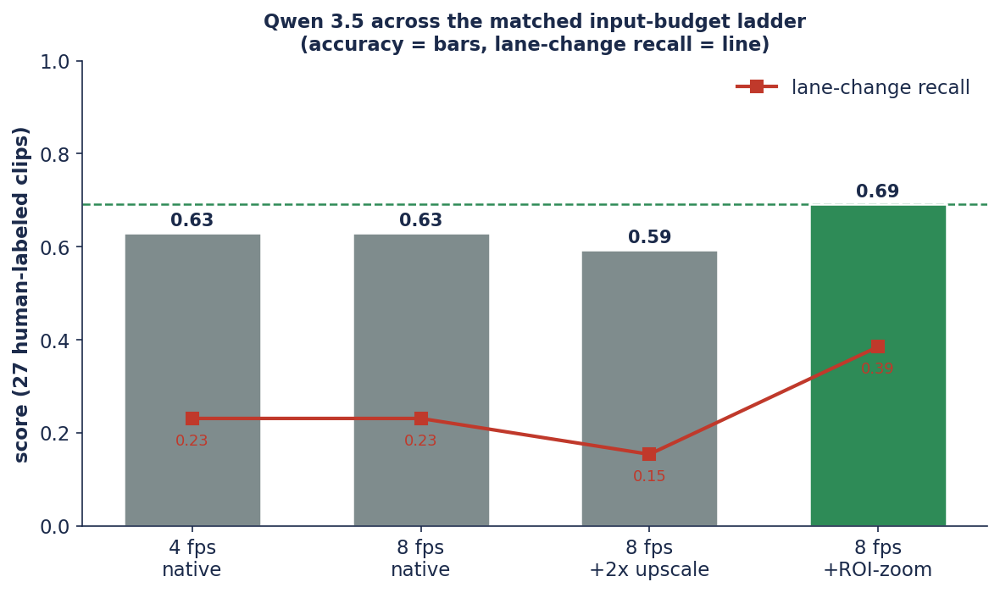

# Ego-Lane Behavior with a General-Purpose Reasoning VLM: Evaluating Qwen 3.5 (MoE) Against Driving-Tuned Cosmos Models

*A companion study to the Cosmos reports. We run a general-purpose reasoning
vision–language model — Qwen 3.5 (MoE) — through the same matched input-budget
ladder used for Cosmos 2 and Cosmos 3, to see how a non-driving-specialized model
behaves on fine-grained ego-lane behavior and which input levers, if any, move it.*

| | |
|---|---|
| **Version** | 1.0 — June 24, 2026 |
| **Repository** | [`ykirpichev/cosmos-reason2-lane-eval`](https://github.com/ykirpichev/cosmos-reason2-lane-eval) |
| **Model** | `Qwen/Qwen3.6-35B-A3B-FP8` (arch `Qwen3_5MoeForConditionalGeneration`; ~35B total / ~3B active, FP8), served via vLLM |
| **Baselines** | `nvidia/Cosmos3-Super`, `nvidia/Cosmos-Reason2-32B` (see companion reports) |
| **Evaluation set** | 27 human-labeled BATON dashcam clips (13 lane-crossings, 14 lane-keeps); 150-clip pseudo-label scale check |
| **Companion reports** | [Cosmos 3 staged diagnosis](cosmos3_report.md) · [Cosmos 2 frame-rate study](cosmos2_report.md) |

> **Executive summary.** On ego-lane behavior classification, Qwen 3.5 (MoE)
> reaches **0.69 accuracy / 0.56 F1** at its best configuration (8 fps +
> ROI-crop + zoom) over 27 human-labeled dashcam clips, up from **0.63 at default
> settings**. Its behavior is consistent across the ladder: **perfect precision
> (it never reports a lane change that did not occur) but low recall** (it misses
> a majority of real crossings). The frame-rate lever that benefits Cosmos 3 does
> not move Qwen (0.63 at both 4 and 8 fps), and a whole-frame 2× upscale slightly
> lowers it; the one lever that helps is the **targeted** ROI-crop + zoom — the
> same lever that is decisive for Cosmos 3 — which raises crossing recall from
> 0.23 to 0.38. Even so, Qwen plateaus well below the driving-tuned Cosmos 3
> (0.93) and at roughly the level of the native Cosmos 2 baseline (0.74), placing
> a capable general VLM between the two specialized models on this task. The
> evaluation set is small (27 clips), so comparative deltas carry a ±0.1 noise
> floor (§8).

> **Reproducibility status.** All numbers are reproducible from committed
> artifacts. Qwen was evaluated under the **same matched ladder** as the Cosmos
> models (4 fps native, 8 fps native, whole-frame 2×, ROI-zoom) on the 27
> human-labeled clips (`results/qwen_*`), consolidated by `scripts/headtohead.py`
> into `results/headtohead.json`, and additionally on the full 150-clip BATON set
> against openpilot pseudo-labels (`results/qwen_roi8_full159/`). Greedy decoding
> throughout (prompt sets `temperature 0`).

---

## Abstract

We evaluate **Qwen 3.5 (MoE)** — a general-purpose reasoning vision–language model
(`Qwen3_5MoeForConditionalGeneration`, ~35B total / ~3B active, FP8) — on **ego-lane
behavior recognition**: classifying a 12-second dashcam clip as *lane keep*, *lane
change*, or *lane wandering*. Using the identical pipeline, prompt, decoding, and
matched input-budget ladder previously applied to NVIDIA's driving-tuned Cosmos 2
and Cosmos 3 models, we ask two questions: (1) how does a strong general VLM perform
on this fine-grained driving task, and (2) which input levers move it? We find that
Qwen exhibits a stable error signature — **high precision, low recall** — across the
ladder: it reliably abstains from false alarms (precision 1.00 on the human set) but
misses most lane crossings. The temporal lever (4→8 fps) leaves it unchanged (0.63),
and a whole-frame 2× upscale slightly reduces accuracy (0.63→0.59); only the
**targeted ROI-crop + zoom** improves it (0.63→0.69 accuracy, crossing recall
0.23→0.38), consistent with the cross-model observation that the *spatial* budget
helps most when it is aimed at the road region. Qwen's best configuration (0.69)
sits below the driving-tuned Cosmos 3 (0.93) and near the native Cosmos 2 baseline
(0.74). We also note a practical deployment detail: as a verbose chain-of-thought
reasoner, Qwen required a substantially larger output-token budget than the Cosmos
models to emit a parseable answer.

---

## 1. Introduction

The Cosmos reports ([Cosmos 3](cosmos3_report.md), [Cosmos 2](cosmos2_report.md))
showed that input conditioning — temporal sampling and spatial token allocation —
can dominate measured accuracy on ego-lane behavior, and that the effective levers
are model-specific. A natural follow-up is whether those conclusions extend to a
**general-purpose** reasoning VLM that was not tuned for driving. This report runs
**Qwen 3.5 (MoE)** through the same matched ladder and answers:

1. **(§3) How does a general VLM perform, and does it respond to the input levers?**
   We sweep the same four configurations (4 fps native, 8 fps native, whole-frame
   2× upscale, ROI-crop + zoom) under identical prompt and greedy decoding.
2. **(§4) How does it compare to the driving-tuned Cosmos models?** We place Qwen on
   the same axes as Cosmos 2 and Cosmos 3.

The practically important error remains the **silent miss**: declaring
`keep_within_lane` on a clip that contains a real lane change.

---

## 2. Task and dataset

Three mutually exclusive behaviors:

| behavior | definition |
|---|---|
| `keep_within_lane` | stays inside the lane; never crosses a lane line |
| `lane_change` | crosses a line and settles in a different lane |
| `lane_wandering` | crosses/rides a line but returns to the same lane |

**Clips.** 150 single-camera BATON clips (openpilot `qcamera`, native **526×330**,
12 s). **Ground truth** is **27 human-labeled clips** (13 lane-crossings, 14
lane-keeps); the full 150-clip set is scored only against noisy openpilot
**pseudo-labels** (lateral-offset derived) and is used for scale/consistency checks.
The positive class for precision/recall/F1 is `lane_change` ("crossing").

**Model and serving.** `Qwen/Qwen3.6-35B-A3B-FP8` is served bare-metal via vLLM
(`scripts/serve_vllm_qwen.sh`, 32k context), reusing the same vLLM build as the
Cosmos 3 server. The model emits `<think>…</think>` chain-of-thought inline; the
final answer is parsed from the JSON block after the reasoning. Because the model is
a verbose reasoner, the output-token budget was raised to 10,000 tokens (the Cosmos
models used 4,096); see §8.

---

## 3. The input-budget ladder

We run the same four configurations used for the Cosmos models, all under identical
prompt and greedy decoding. The only change between configurations is how the video
is presented to the model.



**Figure 1.** Qwen 3.5 across the matched input-budget ladder (27 human-labeled
clips; accuracy = bars, lane-change recall = line). Accuracy is flat across the
temporal lever (4→8 fps), dips with a whole-frame 2× upscale, and is highest with
the targeted ROI-crop + zoom.

| config (27 clips, greedy) | accuracy | crossing P | R | F1 | crossings caught | false-pos |
|---|---|---|---|---|---|---|
| 4 fps native | 0.63 | 1.00 | 0.23 | 0.38 | 3 / 13 | 0 |
| 8 fps native | 0.63 | 1.00 | 0.23 | 0.38 | 3 / 13 | 0 |
| 8 fps + whole-frame 2× | 0.59 | 1.00 | 0.15 | 0.27 | 2 / 13 | 0 |
| **8 fps + ROI-crop + zoom** | **0.69**¹ | 1.00 | **0.38** | **0.56** | 5 / 13 | 0 |

¹ n=26: one clip (`lane_recovery__10`) produced chain-of-thought that exceeded the
10,000-token budget without emitting a parseable answer and is excluded. *Source:
`results/headtohead.json`.*

**Findings.**
- **Stable error signature.** Across every configuration, precision is **1.00** —
  Qwen does not report lane changes that did not happen — while recall stays low. It
  is a consistent *abstainer*: when unsure, it calls `keep_within_lane`.
- **The temporal lever does not move Qwen.** Accuracy is identical at 4 and 8 fps
  (0.63, 3/13 crossings). This differs from Cosmos 3 (where 4→8 fps is decisive) and
  resembles Cosmos 2's behavior beyond its native rate.
- **Whole-frame upscaling does not help.** A uniform 2× upscale slightly lowers
  accuracy (0.63→0.59) and recall (0.23→0.15), the same direction observed for the
  Cosmos models: the added tokens are spent on regions without lane information.
- **The targeted ROI lever helps most.** ROI-crop + zoom raises accuracy to 0.69 and
  crossing recall to 0.38 (5/13), the only lever that improves Qwen. This is the same
  lever that is decisive for Cosmos 3, supporting the cross-model observation that
  the spatial budget is most useful when aimed at the road region — though the
  magnitude of the gain is model-dependent.

---

## 4. Three-way comparison

Placing Qwen on the same axes as the driving-tuned Cosmos models (matched ladder, 27
human-labeled clips):


**Figure 2.** Lane-behavior accuracy across three reasoning VLMs on the same matched
configurations. The models respond differently to the same input levers: Cosmos 2 is
highest at its native 4 fps, Cosmos 3 climbs steeply with frames and ROI tokens, and
Qwen 3.5 is largely flat with a modest gain from ROI.

| config (27 clips, accuracy) | Cosmos 2 | Cosmos 3 | Qwen 3.5 |
|---|---|---|---|
| 4 fps native | **0.74** | 0.56 | 0.63 |
| 8 fps native | 0.67 | 0.78 | 0.63 |
| 8 fps + whole-frame 2× | 0.69 | 0.74 | 0.59 |
| 8 fps + ROI-crop + zoom | 0.67 | **0.93** | 0.69 |

| best config per model | accuracy | crossing recall |
|---|---|---|
| Cosmos 2 — 4 fps native | 0.74 | 0.46 |
| **Cosmos 3 — 8 fps + ROI-zoom** | **0.93** | **0.85** |
| Qwen 3.5 — 8 fps + ROI-zoom | 0.69 | 0.38 |

**Reading.** A capable general-purpose VLM lands **between** the two driving-tuned
models on this task: Qwen's best configuration (0.69) is close to the native
Cosmos 2 baseline (0.74) and well below the tuned Cosmos 3 (0.93). The most
transferable finding across all three models is that the **ROI-crop + zoom** spatial
lever is the one that helps whenever a model responds to the spatial budget at all
(strongly for Cosmos 3, modestly for Qwen), whereas frame rate is model-specific.
Qwen's persistent low recall — even with the targeted lever — indicates that the
fine-grained ego-motion cue (a lane line sliding under the hood over ~1 second)
remains difficult for a model that was not specialized for driving perception.

---

## 5. Scale check on the full BATON set

To confirm the headline is not an artifact of 27 clips, we ran the final ROI config
on the **full 150-clip BATON set**, scored against openpilot pseudo-labels (noisy:
curve artifacts, change↔wander ambiguity — see §2). These are agreement numbers, not
ground truth.

| full-set ROI-zoom (pseudo-labels) | n | accuracy | crossing recall |
|---|---|---|---|
| Cosmos 2 | 142 | 0.52 | 0.26 |
| Cosmos 3 | 150 | 0.55 | 0.40 |
| **Qwen 3.5** | 145 | 0.46 | 0.13 |

**Reading.** As with the Cosmos models, absolute agreement against pseudo-labels is
much lower than on the human-labeled set, reflecting pseudo-label noise rather than
model capability (the offset signal cannot cleanly separate `lane_change` from
`lane_wandering` after the car re-centers). The full-set run is best read as a
**pseudo-label agreement check**. The ordering it preserves — Cosmos 3 > Cosmos 2 >
Qwen on crossing recall — is consistent with the human-labeled set, where Qwen's
crossing recall is the lowest of the three.

---

## 6. Discussion: why Qwen plateaus

The error signature is consistent across every configuration: **high precision,
low recall.** Qwen rarely reports a lane change that did not occur (precision 1.00 on
the human set), but it misses a majority of real ones. The ROI-crop + zoom lever
improves recall (0.23→0.38) but does not close the gap to the driving-tuned Cosmos 3
(0.85). Two observations:

- **The right lever transfers; the ceiling does not.** ROI-crop + zoom is the most
  effective spatial intervention for both Qwen and Cosmos 3, but Qwen converts far
  fewer of its misses into detections when given the same legible road pixels. This
  is consistent with a model that can read the scene but is less calibrated to the
  specific ego-motion signature of a lane crossing.
- **Conservative by default.** Perfect precision with low recall makes Qwen a safe
  *abstainer* but a weak *detector* for this task — useful if false positives are
  costly, but not if the goal is to mine lane-change examples.

These results should not be read as a general ranking of the models — only as their
behavior on this specific fine-grained, temporally localized driving task under a
shared, driving-oriented prompt.

---

## 7. Reproducibility

```bash
# Serve Qwen (bare-metal vLLM; reuses the Cosmos 3 venv's vLLM build)
scripts/serve_vllm_qwen.sh

# Matched ladder on the 27 human-labeled clips (greedy; concurrency batches
# requests server-side; verbose reasoner needs a larger output-token budget)
MODEL=Qwen/Qwen3.6-35B-A3B-FP8
IDS=$(.venv/bin/python -c "import json;print(' '.join(sorted(json.load(open('results/human_labels_old_taxonomy.json')))))")
.venv/bin/python scripts/run_batch.py --manifest clips/manifest_all.json --model $MODEL --fps 4 \
  --media-path-prefix "$PWD" --output results/qwen_4fps_native --ids $IDS --max-tokens 10000 --concurrency 8
.venv/bin/python scripts/run_batch.py --manifest clips/manifest_final27_8fps_native.json --model $MODEL --fps 8 \
  --media-path-prefix "$PWD" --output results/qwen_8fps_native --max-tokens 10000 --concurrency 8
.venv/bin/python scripts/run_batch.py --manifest clips/manifest_final27.json --model $MODEL --fps 8 \
  --media-path-prefix "$PWD" --output results/qwen_8fps2x --max-tokens 10000 --concurrency 8
.venv/bin/python scripts/exp_roi8.py --model $MODEL --output results/qwen_roi8 --clips human27 \
  --max-tokens 10000 --concurrency 8

# Full 150-clip BATON set at the final ROI config (pseudo-labels)
.venv/bin/python scripts/exp_roi8.py --model $MODEL --output results/qwen_roi8_full159 --clips all \
  --max-tokens 10000 --concurrency 8

# Consolidate every run into one scored table -> results/headtohead.json
.venv/bin/python scripts/headtohead.py

# Figures -> docs/assets/qwen/
.venv/bin/python scripts/make_qwen_figs.py

# Inspect individual cases (run/mode/clip deep-linked)
.venv/bin/streamlit run apps/review_disagreements.py --server.port 8503
```

---

## 8. Limitations and future work

- **Small ground-truth set.** Headline metrics are on 27 clips (13 crossings); ±1–2
  detections move F1 by ~0.1. The full-set numbers use noisy pseudo-labels.
- **Verbose chain-of-thought / output budget.** Qwen is a verbose reasoner and
  required a 10,000-token output budget (vs 4,096 for the Cosmos models) to emit a
  parseable answer; even so, one ROI clip exceeded the budget without producing JSON
  (scored at n=26), and five clips were unparseable on the full set (n=145). A
  shorter, structured-output prompt or a server-side reasoning parser with a hard
  answer schema could reduce these losses.
- **Single prompt, not Qwen-tuned.** The prompt was designed for the Cosmos models
  and reused verbatim for a clean comparison. A Qwen-specific prompt (or
  few-shot/self-consistency decoding) might raise recall; this report measures the
  matched-prompt baseline only.
- **Determinism.** As with Cosmos 3, the ROI human-27 subset re-scored from the
  full-set run differs slightly from the dedicated run (0.63 vs 0.69), within the
  small-sample noise floor and consistent with nondeterminism in the serving stack.

---

## 9. Conclusion

A capable general-purpose reasoning VLM, Qwen 3.5 (MoE), performs this fine-grained
ego-lane behavior task at roughly the level of the native Cosmos 2 baseline and well
below the driving-tuned Cosmos 3. Its behavior is a consistent **high-precision,
low-recall** abstainer: it does not invent lane changes but misses most of them. Of
the input levers, only the **targeted ROI-crop + zoom** improves it — the same lever
that is decisive for Cosmos 3 — while frame rate and whole-frame upscaling do not
help, reinforcing the cross-model lesson that the spatial budget matters most when it
is aimed at the road region and that input-budget responses are model-specific. The
practical takeaways: **(1)** profile input levers per model rather than assuming they
transfer; **(2)** prefer the targeted ROI lever as the most broadly useful spatial
intervention; and **(3)** for verbose reasoners, budget the output tokens (and
consider structured-output constraints) to avoid losing answers to runaway
chain-of-thought.
