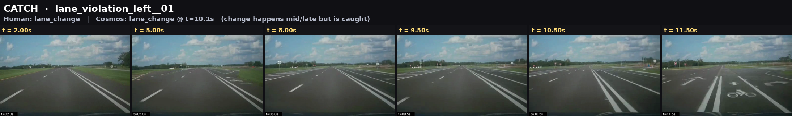
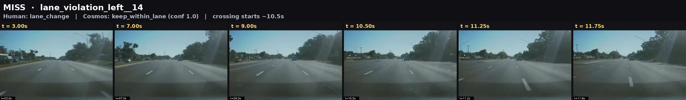
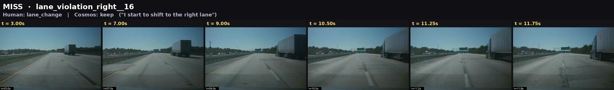
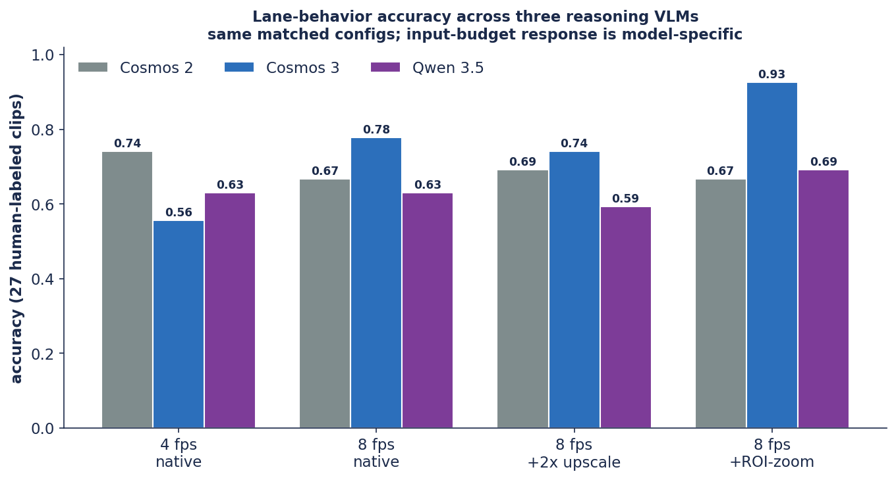

# Ego-Lane Behavior, Head-to-Head: Cosmos 3 vs. Cosmos 2 vs. Qwen 3.6

*A consolidated summary of the three deep-dive reports. One fine-grained task —
read a short forward dashcam clip and decide whether the ego car kept its lane,
changed lanes, or wandered — run across two driving-tuned Cosmos models and one
general-purpose reasoning VLM under a single matched input ladder. A public-data
benchmark: all clips, prompts, and code are in this repository.*

| | |
|---|---|
| **Version** | 1.0 — June 25, 2026 |
| **Repository** | [`ykirpichev/cosmos-reason2-lane-eval`](https://github.com/ykirpichev/cosmos-reason2-lane-eval) |
| **Models** | `nvidia/Cosmos3-Super`, `nvidia/Cosmos-Reason2-32B`, `Qwen/Qwen3.6-35B-A3B-FP8`, all served via vLLM |
| **Evaluation set** | 27 human-labeled BATON dashcam clips (13 lane-crossings, 14 lane-keeps); 150-clip pseudo-label scale check |
| **Deep-dive reports** | [Cosmos 3 staged diagnosis](cosmos3_report.md) · [Cosmos 2 frame-rate study](cosmos2_report.md) · [Qwen 3.6 matched-ladder cross-check](qwen_report.md) |

> **Bottom line.** At each model's best configuration, **Cosmos 3 reaches 0.93
> accuracy** — well ahead of Cosmos 2 (0.74) and Qwen 3.6 (0.69). The gap is widest
> on the safety-relevant metric: Cosmos 3 **catches 85% of real lane crossings**
> versus 46% (Cosmos 2) and 38% (Qwen). All three models run through the same
> pipeline, the same prompt, and the same four-step input ladder, so the
> differences come from the models and from how the video is presented to them —
> not from per-model tuning.

---

## The task

Three mutually exclusive behaviors per 12-second clip:

| behavior | definition |
|---|---|
| `keep_within_lane` | Stays inside the lane; never crosses a lane line. |
| `lane_change` | Crosses a line and settles in a different lane. |
| `lane_wandering` | Crosses or rides a line, then returns to the same lane. |

The positive class for precision/recall is `lane_change`. The practically
important error is the **silent miss**: declaring `keep_within_lane` on a clip that
contains a real crossing.

## Best configuration, head-to-head

| model | best config | accuracy | crossings caught |
|---|---|---|---|
| **Cosmos 3** | 8 fps + ROI-crop + zoom | **0.93** | **0.85** |
| Cosmos 2 | 4 fps native | 0.74 | 0.46 |
| Qwen 3.6 MoE | 8 fps + ROI-crop + zoom | 0.69 | 0.38 |

## The data and the winning lever

Each clip is a 12-second, 526×330 forward dashcam view. At native resolution
roughly a third of the image tokens land on sky and the car's hood — regions that
carry no lane information. The **ROI-crop + zoom** lever crops to the road band and
upscales 2×, spending the same token budget on the part of the frame where a lane
line slides under the car. That is the cue separating a crossing from a keep, and
making it legible is what moves Cosmos 3 the most. A uniform whole-frame upscale
does not help — it adds tokens everywhere, including the regions that were never
informative.

## Caught vs. missed

"Crossings caught" is recall on real crossings — the share of genuine lane changes
a model flags rather than labeling `keep_within_lane`. This is the number that
governs data mining: a missed crossing is an event that never enters the training
set.

A crossing correctly caught:

Two silent misses — a real crossing labeled `keep_within_lane`; in the second, the
model's own reasoning notes it is shifting right, yet the emitted label stays
`keep`:

## Accuracy across the full input ladder

| config (27 clips, accuracy) | Cosmos 2 | Cosmos 3 | Qwen 3.6 |
|---|---|---|---|
| 4 fps native | **0.74** | 0.56 | 0.63 |
| 8 fps native | 0.67 | 0.78 | 0.63 |
| 8 fps + whole-frame 2× | 0.69 | 0.74 | 0.59 |
| 8 fps + ROI-crop + zoom | 0.67 | **0.93** | 0.69 |

Frame rate is the decisive lever for Cosmos 3 (4→8 fps: 0.56→0.78) and leaves Qwen
flat; the ROI-crop + zoom lever is what lifts Cosmos 3 to 0.93. The input-budget
response is model-specific, so levers should be profiled per model rather than
assumed to transfer.

## Scale check — full 150-clip BATON set

Scored against noisy openpilot pseudo-labels (agreement, not ground truth), so
absolute numbers run lower than on the human-labeled set.

| ROI-zoom config (pseudo-labels) | n | accuracy | crossings caught |
|---|---|---|---|
| **Cosmos 3** | 150 | **0.55** | **0.40** |
| Cosmos 2 | 142 | 0.52 | 0.26 |
| Qwen 3.6 | 145 | 0.46 | 0.13 |

The ordering Cosmos 3 > Cosmos 2 > Qwen on crossing recall is consistent with the
human-labeled set.

## How it was measured

- **Models.** Cosmos 3 (`nvidia/Cosmos3-Super`), Cosmos 2 (`nvidia/Cosmos-Reason2-32B`), Qwen 3.6 MoE (`Qwen/Qwen3.6-35B-A3B-FP8`, ~35B total / ~3B active), all served via vLLM.
- **Decoding.** Greedy (temperature 0); one identical driving-oriented prompt reused verbatim across all three models.
- **Input ladder.** 4 fps native → 8 fps native → 8 fps + whole-frame 2× → 8 fps + ROI-crop + zoom. Only the video presentation changes between steps.
- **Evaluation.** 27 human-labeled clips (13 crossings / 14 keeps) for headline metrics; 150-clip BATON set vs. openpilot pseudo-labels for the scale check.
- **Practical note.** Qwen is a verbose chain-of-thought reasoner and needed a 10,000-token output budget (vs. 4,096 for Cosmos) to emit a parseable answer; one clip still overran it.

## TL;DR

Cosmos 3 is, without ambiguity, the **stronger baseline** for ego-lane behavior.
On matched inputs it leads every configuration's best result — **0.93 accuracy,
0.85 crossing recall** — and it is the only model that turns a larger spatial token
budget into real detections. The lead is conditional on the ROI-crop + zoom
front-end: at naive 4 fps the three models bunch up, so the pipeline is part of the
result, not an afterthought. A general-purpose reasoning VLM is not a drop-in
substitute here — Qwen never false-alarms (precision 1.00) but misses most
crossings, and input budgeting cannot convert that conservative bias into
detections.

These results describe behavior on this specific fine-grained, temporally
localized task under a shared, driving-oriented prompt; they should not be read as
a general capability ranking of the models.

---

**Deep-dive reports:**
[Cosmos 3 — staged diagnosis](cosmos3_report.md) ·
[Cosmos 2 — frame-rate study](cosmos2_report.md) ·
[Qwen 3.6 — matched-ladder cross-check](qwen_report.md)
